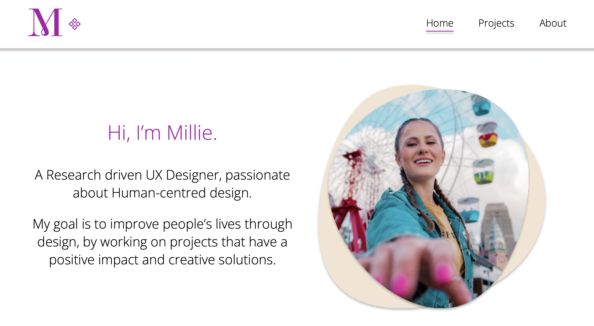

# Millie's Portfolio Website
@MilliePoli portfolio website 

## Try it out
Access the live website: [Millie's Portfolio Website](https://milliepoli.netlify.app).

## Introduction
This project is a collaboration work with a recent graduate UX Designer @MilliePoli.

## Project Description
The project was conduct based on:
- Zoom meetings to understand the designer’s vision and communicate implementation limitations;
- Interactions/chats through the Figma tool to alert to some design changes: [Figma file](https://www.figma.com/file/jymFtfQsG6BAMvY8b97YiV/Millie---Portfolio?node-id=307%3A22);

## Tech Stack
* HTML
* CSS
* Vanilla JS

## Images

